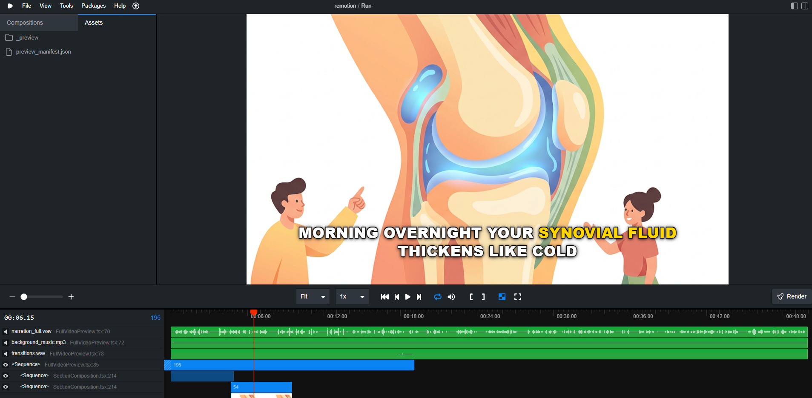
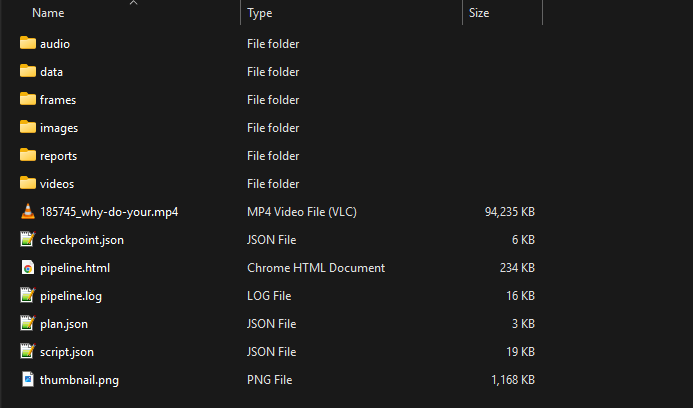

# Video Factory

Multi-agent AI video production system that turns a topic into a YouTube-ready
video package: script, visuals, narration, rendered MP4, thumbnail, metadata,
review reports, and cost traces.







What it does:

- Plans channel-aware topics from JSON configuration and topic history
- Generates scripts, metadata, visual briefs, and thumbnail strategy
- Sources or generates images and B-roll, then reviews them for relevance
- Generates TTS narration with word-level timing for subtitles
- Renders animated sections with Remotion and assembles the final MP4
- Creates and reviews YouTube thumbnails
- Tracks checkpoints, retries, validation failures, AI traces, and estimated cost

Video Factory is a personal project.

This public repo includes a generic `demo_channel` configuration. Production
channel configs, generated workspaces, private research notes, API keys, and
runtime media outputs are intentionally excluded.

## Architecture

```text
planning -> script -> image_source + audio_source -> process
         -> render_sections -> assemble -> thumbnail -> final_review
```

Four Gemini vision review gates run at script, image, thumbnail, and final
review. Failures trigger regeneration with feedback up to a configurable retry
limit.

## Prerequisites

- Python 3.11+
- Node.js 18+ and npm (for Remotion rendering)
- FFmpeg on PATH
- Google Cloud project with Application Default Credentials configured
- Provider keys:
  - **Serper** — web image search
  - **Pexels** — stock photo and B-roll sourcing

## Setup

```bash
git clone https://github.com/Nesgc/video-factory-public.git
cd video-factory-public

python -m venv .venv
source .venv/bin/activate  # or .venv\Scripts\activate on Windows

pip install -r requirements.txt

cd rendering/remotion && npm install && cd ../..

cp .env.example .env
# Edit .env with your project ID and provider keys
```

Authenticate Google Cloud locally before running AI or speech stages:

```bash
gcloud auth application-default login
gcloud config set project your-gcp-project-id
```

## Usage

```bash
# Full pipeline
python factory.py --channel demo_channel

# Run up to a specific stage
python factory.py --channel demo_channel --stage ..script

# Run a range of stages
python factory.py --channel demo_channel --stage process..thumbnail

# Target a specific workspace
python factory.py --channel demo_channel --workspace workspace/path --stage script

# Override config fields ad-hoc
python factory.py --channel demo_channel --set video.target_duration_minutes=1

# Replay fixtures (zero-cost re-runs using cached API responses)
python factory.py --channel demo_channel --fixtures replay

# Open the latest workspace in Remotion Studio
python factory.py --channel demo_channel --preview-remotion --set video.target_duration_minutes=1 --set gemini_tts_model=gemini-2.5-flash-tts
```

### CLI flags

| Flag | Purpose |
|---|---|
| `--channel` | Channel slug to load from `config/channels/` (required) |
| `--stage` | Stage control: `script` (that stage only), `..script` (up to), `process..thumbnail` (range) |
| `--workspace` | Target a specific workspace (skips auto-detection) |
| `--preview-remotion` | Run through `process`, stage assets for Remotion Studio preview, and open Studio |
| `--allow-review-failures` | Comma-separated review gates to continue after max retries |
| `--fixtures` | Record or replay API responses via `.fixtures/` (`record` or `replay`) |
| `--set` | Override channel config fields with dot notation (repeatable) |

Stages in order: `planning`, `script`, `image_source`, `audio_source`, `process`, `render_sections`, `assemble`, `thumbnail`, `final_review`.

## Project Structure

```text
video-factory/
├── factory.py                  # CLI entry point + pipeline orchestrator
├── settings.py                 # Global paths + env-driven settings (Pydantic)
├── clients.py                  # Google AI client, fixture replay, and AI traces
├── prompts.py                  # Prompt templates for all stages and review gates
├── core/
│   ├── scripter.py             # Script generation + review loop
│   ├── image_sourcer.py        # Multi-source image acquisition + review
│   ├── audio_sourcer.py        # TTS narration + STT timestamps + music
│   ├── processor.py            # Smart crop, face detection, resize
│   ├── render_sections.py      # Per-section Remotion rendering
│   ├── preview_remotion.py     # Remotion preview manifest + Studio launcher
│   ├── assembler.py            # FFmpeg concat + xfade + audio mix
│   ├── thumbnailer.py          # Thumbnail generation + review
│   ├── reviewer.py             # Universal AI review gate engine
│   ├── costs.py                # Per-run cost ledger and pricing
│   ├── validator.py            # Post-stage invariant checks
│   └── utils.py                # Pydantic models, file I/O, logging
├── tools/
│   ├── log_viewer.py           # HTML report rendering
│   └── reconcile_gcp_costs.py  # Query Cloud Billing export for actual run cost
├── config/
│   ├── pricing/                # Canonical Google AI pricing catalog
│   └── channels/               # Per-channel JSON configs
│       └── demo_channel.json
├── rendering/remotion/         # Remotion rendering engine (Node.js)
├── assets/
├── tests/
└── workspace/                  # Runtime output (one folder per run)
```

## How It Works

**Planning** — Gemini selects a topic, video type, and title format based on the channel config and past topic history to avoid repeats.

**Script** — Gemini writes narration, per-section image prompts, and metadata. Word-budget validation and a review gate run before the script is saved.

**Image sourcing** — Each slot is sourced in parallel from Serper web search, Pexels stock photos, Pexels B-roll, or Gemini image generation depending on the slot type. A vision review gate checks relevance before processing.

**Audio sourcing** — Per-section TTS via Gemini with word-level timestamps from Google Cloud STT. Background music is selected from the channel's music pool.

**Process** — OpenCV face detection for smart crop. Resizes all images to target resolution (default 1920×1080).

**Render sections** — Each script section is rendered as a standalone clip using Remotion's `SectionComposition` with Ken Burns animation, subtitles, and watermark. FFmpeg NVENC encodes each clip on Windows.

**Assemble** — FFmpeg concatenates section clips with xfade transitions and mixes narration with background music.

**Thumbnail** — Gemini generates the thumbnail from the channel's `thumbnail_strategy` plus script context. A vision review gate checks readability and strategy fit.

**Final review** — 8–12 frames are extracted and reviewed by Gemini vision against the full package (frames + thumbnail + metadata).

After final review the workspace contains the finished MP4, `thumbnail.png`, and metadata for manual upload.

## Channel Configuration

Each channel is a JSON file in `config/channels/`. Key sections:

| Section | Purpose |
|---------|---------|
| `niche` | Category, audience, content style, example/avoid topics |
| `video` | Target duration, resolution, FPS, transitions, music pool, B-roll ratio |
| `video_types` | Listicle, narrative, explainer — pacing, style, and allowed thumbnail strategies |
| `voice` | TTS voice name, language, voice prompt |
| `image_sourcing` | Gemini image model and style prompt suffix |
| `youtube` | Category, tags, title formats, and description styles |
| `script_style` | Tone and writing instructions for the scriptwriter |
| `business_strategy` | Optional: channel goal, content families, CTA rules, and offer ladder |
| `review_thresholds` | Min scores and max retry counts per review gate |
| `thumbnail_strategies` | Channel-level AI thumbnail strategy definitions |
| `style` | Visual effects, text colors, transitions, watermark |

## Environment Variables

| Variable | Purpose |
|----------|---------|
| `GOOGLE_PROJECT_ID` | Vertex AI project |
| `GOOGLE_CLOUD_LOCATION` | Vertex AI region (default: global) |
| `GOOGLE_STT_LOCATION` | Speech-to-Text region (default: us-central1) |
| `SERPER_API_KEY` | Web image search |
| `PEXELS_API_KEY` | Stock photo fallback |

## GCP Services

| API | Service | Used for |
|-----|---------|----------|
| `aiplatform.googleapis.com` | Vertex AI | Gemini text, vision, TTS, and image generation |
| `speech.googleapis.com` | Speech-to-Text | Word-level narration timestamps |

Enable Cloud Billing export to BigQuery and use `tools/reconcile_gcp_costs.py` to reconcile estimated vs. actual spend per workspace run.

## Workspace Output

Each run creates `workspace/{channel}_{timestamp}_{uuid}/`:

```text
├── checkpoint.json         # Pipeline state (enables resume via --stage)
├── plan.json               # Topic selection result
├── script.json             # Full script with sections
├── images/raw/             # Source images
├── images/ready/           # Processed images
├── audio/sections/         # Per-section WAV files
├── audio/narration_full.wav
├── videos/sections/        # Per-section Remotion renders
├── YYYY-MM-DD_HHMMSS_title-slug.mp4
├── thumbnail.png
├── frames/                 # Extracted frames for final review
└── reports/                # Cost estimate, AI trace, and stage reports
```
